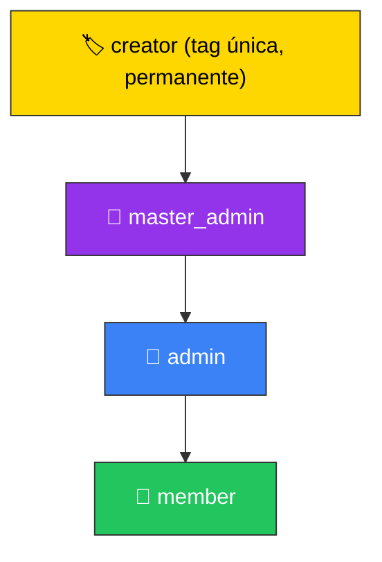
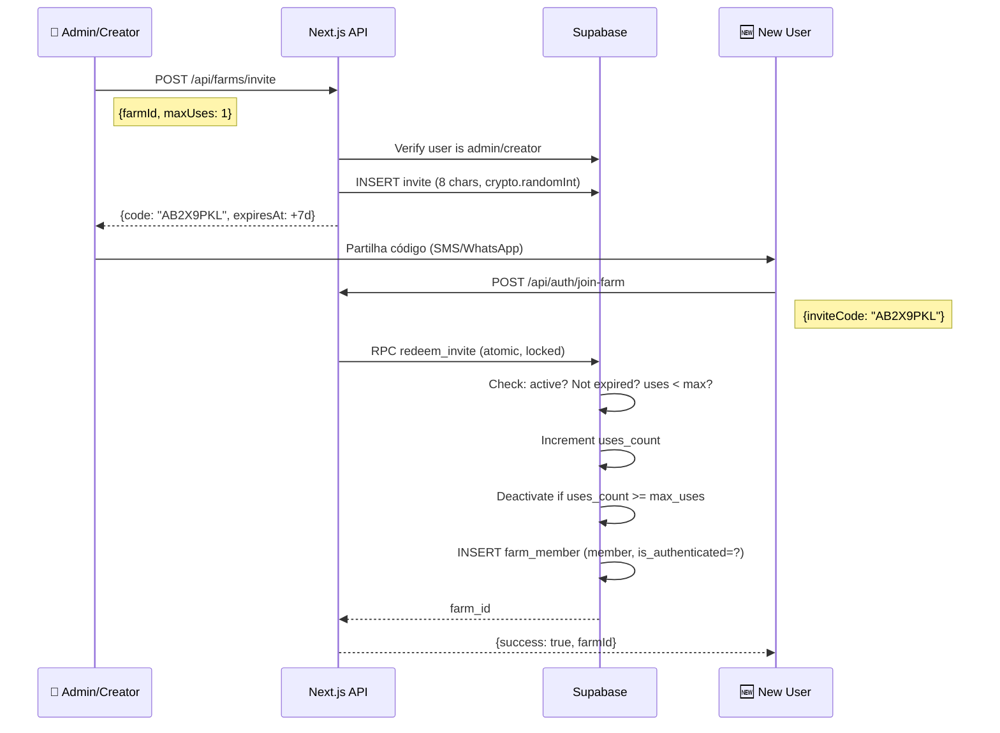

# 🔬 Code Review — V2 (Actualizado)

**Branch**: `feature/26-enhance-tracking-and-security-050` vs `origin/main`  
**Scope**: ~59 ficheiros, ~3000 linhas  
**Data**: 2026-06-24 (V2 — com feedback do utilizador)

---

## Alterações face à V1

> [!NOTE]
> Items reclassificados com base no feedback do utilizador:
> - **C5 (proxy.ts)** → ✅ **Correcto**. Next.js 16 renomeou oficialmente `middleware.ts` → `proxy.ts` e a função `middleware()` → `proxy()`. A migração foi feita correctamente.
> - **C1 (RLS locations legacy)** → Reclassificado para **⚠️ Melhoria**. O acesso requer um invite code privado que é partilhado apenas por membros, logo o risco é menor do que indicado. Mantém-se como recomendação de defesa em profundidade.
> - **C2 (Invite brute-force)** → Expandido com a **proposta P1** de roles e invites redesenhados.
> - **C3 (NetworkMonitor)** → Expandido com a **proposta P2** de Koin DI.

---

## 🚨 Problemas Críticos (Blockers) — Actualizados

### C1 — ~~BLOCKER~~ → ⚠️ Melhoria: RLS Legacy Devices

> [!NOTE]
> **Reclassificado**: O utilizador esclareceu que o acesso a farms requer um invite code privado. Dispositivos legacy sem farm/user são da migração inicial e assumem-se como pertencentes à "família original". O risco prático é menor porque um atacante precisa de um invite code válido para se juntar.

Contudo, **recomendo** apertar a RLS para defesa em profundidade — remover o fallback `user_id IS NULL` quando todos os dispositivos estiverem migrados:

```sql
-- Quando a migração de devices estiver completa, aplicar:
CREATE POLICY "Farm members: view shared devices (strict)"
    ON public.devices FOR SELECT TO authenticated
    USING (
        user_id = auth.uid() OR
        farm_id IN (
            SELECT farm_id FROM public.farm_members WHERE user_id = auth.uid()
        )
        -- Removido: OR (user_id IS NULL AND farm_id IS NULL)
    );
```

---

### C2 — ~~BLOCKER~~ → Redesenho Completo (ver Proposta P1)

O sistema de invite codes e roles será completamente redesenhado na **Proposta P1** abaixo.

---

### C4 — 💀 Object Churn no `storeRecord()` (MANTÉM-SE BLOCKER)

[Detalhes na V1 — sem alteração]

---

### C5 — ~~BLOCKER~~ → ✅ Correcto: `proxy.ts` é a migração oficial

**Confirmado**: Next.js 16.x renomeou oficialmente:
- `middleware.ts` → `proxy.ts`
- `export function middleware()` → `export function proxy()`
- `export const config` mantém-se igual

O codemod oficial é: `npx @next/codemod@canary middleware-to-proxy`

O ficheiro `proxy.ts` está na localização correcta (`backend/proxy.ts`, raiz do Next.js app), exporta `proxy()`, e tem o `config.matcher` correcto. **Nenhuma acção necessária**.

---

### C6 — 💀 `resetSyncingToPending()` Global (MANTÉM-SE BLOCKER)

[Detalhes na V1 — sem alteração]

---

## 📐 Propostas de Arquitectura (Novas)

---

### P1 — Sistema de Roles e Permissões para Farms

Com base nos requisitos definidos pelo utilizador:

#### Hierarquia de Roles (Tags Aditivas)



| Tag | Requer Auth? | Permissões Exclusivas |
|-----|-------------|----------------------|
| `creator` | Sim | Tag permanente. Pode gerar invite de uso único. Não pode ser removida (apenas demoted de outras tags). |
| `master_admin` | Sim | Promover/demover `admin` ↔ `master_admin`. Expulsar `owner`. Todas as permissões de `admin`. |
| `admin` | Sim | Promover/demover `member` ↔ `admin`. Expulsar `member`. Gerar invite codes. Todas as permissões de `member`. |
| `member` | Não* | Consultar localizações de todos os membros da família. Flag `is_authenticated` para UI. |

*\*Members não autenticados entram via join anónimo do Supabase e são marcados com `is_anonymous = true`.*

> [!IMPORTANT]
> **Tags são aditivas**: Um utilizador pode ter `creator` + `master_admin` em simultâneo. Ou `admin` + `member`. A tag `creator` coexiste sempre com pelo menos `member`.

#### Schema SQL Proposto

```sql
-- 013_role_system_upgrade.sql
-- Upgrades the role system to support additive tags

-- 1. Replace single 'role' column with a tag-based system
-- Keep backward compatibility by not dropping the old column immediately
ALTER TABLE public.farm_members
  ADD COLUMN IF NOT EXISTS is_creator BOOLEAN NOT NULL DEFAULT FALSE,
  ADD COLUMN IF NOT EXISTS is_master_admin BOOLEAN NOT NULL DEFAULT FALSE,
  ADD COLUMN IF NOT EXISTS is_admin BOOLEAN NOT NULL DEFAULT FALSE,
  ADD COLUMN IF NOT EXISTS is_authenticated BOOLEAN NOT NULL DEFAULT TRUE;

-- Migrate existing roles to new columns
UPDATE public.farm_members SET is_creator = TRUE, is_master_admin = TRUE, is_admin = TRUE
  WHERE role = 'owner';
UPDATE public.farm_members SET is_admin = TRUE
  WHERE role = 'admin';
-- 'viewer' maps to basic member (no special tags)

-- 2. Add constraints
-- Only one creator per farm
CREATE UNIQUE INDEX IF NOT EXISTS idx_farm_one_creator
  ON public.farm_members(farm_id)
  WHERE is_creator = TRUE;

-- 3. Upgrade farm_invites for single-use codes with expiry
ALTER TABLE public.farm_invites
  ADD COLUMN IF NOT EXISTS max_uses INT NOT NULL DEFAULT 1,
  ADD COLUMN IF NOT EXISTS uses_count INT NOT NULL DEFAULT 0,
  ADD COLUMN IF NOT EXISTS is_active BOOLEAN NOT NULL DEFAULT TRUE;

-- 4. Create a helper function to check permissions
CREATE OR REPLACE FUNCTION public.farm_user_can(
  p_farm_id UUID,
  p_user_id UUID,
  p_permission TEXT  -- 'view', 'invite', 'kick_member', 'promote_admin', 'promote_master', 'kick_owner'
)
RETURNS BOOLEAN
LANGUAGE plpgsql STABLE SECURITY INVOKER AS $$
DECLARE
  v_member RECORD;
BEGIN
  SELECT * INTO v_member
  FROM public.farm_members
  WHERE farm_id = p_farm_id AND user_id = p_user_id;

  IF v_member IS NULL THEN RETURN FALSE; END IF;

  RETURN CASE p_permission
    WHEN 'view' THEN TRUE  -- All members can view
    WHEN 'invite' THEN v_member.is_admin OR v_member.is_master_admin OR v_member.is_creator
    WHEN 'kick_member' THEN v_member.is_admin OR v_member.is_master_admin
    WHEN 'promote_admin' THEN v_member.is_admin OR v_member.is_master_admin
    WHEN 'promote_master' THEN v_member.is_master_admin
    WHEN 'kick_owner' THEN v_member.is_master_admin
    ELSE FALSE
  END;
END;
$$;

-- 5. Secure invite redemption function
CREATE OR REPLACE FUNCTION public.redeem_invite(p_code TEXT)
RETURNS UUID
LANGUAGE plpgsql SECURITY DEFINER AS $$
DECLARE
  v_invite RECORD;
  v_farm_id UUID;
BEGIN
  -- Find and lock the invite
  SELECT * INTO v_invite
  FROM public.farm_invites
  WHERE code = UPPER(p_code)
    AND is_active = TRUE
    AND expires_at > NOW()
    AND uses_count < max_uses
  FOR UPDATE;

  IF v_invite IS NULL THEN
    RAISE EXCEPTION 'Invalid, expired, or fully used invite code';
  END IF;

  v_farm_id := v_invite.farm_id;

  -- Increment usage counter
  UPDATE public.farm_invites
  SET uses_count = uses_count + 1,
      is_active = CASE WHEN uses_count + 1 >= max_uses THEN FALSE ELSE TRUE END
  WHERE id = v_invite.id;

  -- Add user as basic member
  INSERT INTO public.farm_members (farm_id, user_id, is_authenticated)
  VALUES (v_farm_id, auth.uid(), 
          (SELECT NOT is_anonymous FROM auth.users WHERE id = auth.uid()))
  ON CONFLICT (farm_id, user_id) DO NOTHING;

  RETURN v_farm_id;
END;
$$;

-- 6. Updated RLS for farm_invites
DROP POLICY IF EXISTS "Farm owners and admins can read invites" ON public.farm_invites;
DROP POLICY IF EXISTS "Farm owners and admins can create invites" ON public.farm_invites;
DROP POLICY IF EXISTS "Farm owners and admins can delete invites" ON public.farm_invites;

CREATE POLICY "Privileged members can read invites"
  ON public.farm_invites FOR SELECT TO authenticated
  USING (
    EXISTS (
      SELECT 1 FROM public.farm_members fm
      WHERE fm.farm_id = farm_invites.farm_id
        AND fm.user_id = auth.uid()
        AND (fm.is_admin OR fm.is_master_admin OR fm.is_creator)
    )
  );

CREATE POLICY "Privileged members can create invites"
  ON public.farm_invites FOR INSERT TO authenticated
  WITH CHECK (
    EXISTS (
      SELECT 1 FROM public.farm_members fm
      WHERE fm.farm_id = farm_invites.farm_id
        AND fm.user_id = auth.uid()
        AND (fm.is_admin OR fm.is_master_admin OR fm.is_creator)
    )
  );

CREATE POLICY "Privileged members can deactivate invites"
  ON public.farm_invites FOR UPDATE TO authenticated
  USING (
    EXISTS (
      SELECT 1 FROM public.farm_members fm
      WHERE fm.farm_id = farm_invites.farm_id
        AND fm.user_id = auth.uid()
        AND (fm.is_admin OR fm.is_master_admin OR fm.is_creator)
    )
  );
```

#### Invite Code Flow (Redesenhado)



#### API Endpoints Necessários

| Método | Endpoint | Requer | Descrição |
|--------|----------|--------|-----------|
| POST | `/api/farms/invite` | admin+ | Gerar invite code (max_uses, expiry) |
| POST | `/api/farms/kick` | admin+ | Expulsar membro |
| POST | `/api/farms/promote` | admin+/master+ | Promover/demover membro |
| GET | `/api/farms/members` | member+ | Listar membros com flags |

---

### P2 — Dependency Injection com Koin (KMP-Compatible)

> [!IMPORTANT]
> **Hilt não é viável** para este projeto. O módulo `shared/` é KMP (Kotlin Multiplatform) com targets Android + iOS. Hilt é exclusivamente Android (usa annotation processing com `kapt`/`ksp` que não funciona em `commonMain`).
> 
> **Koin** é a alternativa correcta: é puro Kotlin, funciona em `commonMain`, e suporta Android `ViewModel` injection nativamente.

#### Gradle Setup

```kotlin
// mobile/gradle/libs.versions.toml — adicionar:
[versions]
koin = "4.0.0"

[libraries]
koin-core = { module = "io.insert-koin:koin-core", version.ref = "koin" }
koin-android = { module = "io.insert-koin:koin-android", version.ref = "koin" }
koin-compose = { module = "io.insert-koin:koin-androidx-compose", version.ref = "koin" }

// mobile/shared/build.gradle.kts — commonMain:
implementation(libs.koin.core)

// mobile/app/build.gradle.kts — dependencies:
implementation(libs.koin.android)
implementation(libs.koin.compose)
```

#### Module Definitions

```kotlin
// shared/src/commonMain/kotlin/.../di/SharedModule.kt
package com.segurancarural.gpstracker.di

import org.koin.dsl.module

val sharedModule = module {
    // Database (already a singleton via GpsTrackerApplication)
    // DAO
    single { get<AppDatabase>().telemetryDao() }
    
    // SyncEngine
    factory { 
        SyncEngine(
            dao = get(),
            httpClient = get(),
            locationUrl = ApiRoutes.LOCATION_V2,
            emergencyUrl = ApiRoutes.EMERGENCY,
            farmIdProvider = { get<FarmRepository>().currentFarmId }
        )
    }
}

// app/src/main/java/.../di/AppModule.kt
package com.segurancarural.gpstracker.di

import org.koin.core.module.dsl.viewModel
import org.koin.dsl.module

val appModule = module {
    // ── Singletons ─────────────────────────────────────────
    single { NetworkMonitor(get()) }  // ← Singleton! Resolve C3
    single { FarmRepository(get()) }
    single { FamilyPositionsRepository() }
    single { TelemetryRepository(get()) }
    single { DeviceConfigRepository(get()) }
    single { SubmitLocationUseCase(get()) }
    
    // ── ViewModels ─────────────────────────────────────────
    viewModel { MapViewModel(get()) }
    viewModel { HomeViewModel(get()) }
    viewModel { FamilyGroupsViewModel(get()) }
}
```

#### Application Setup

```kotlin
// GpsTrackerApplication.kt
class GpsTrackerApplication : Application(), KoinComponent {
    
    lateinit var database: AppDatabase
    
    override fun onCreate() {
        super.onCreate()
        database = Room.databaseBuilder(...)...build()
        
        startKoin {
            androidContext(this@GpsTrackerApplication)
            modules(sharedModule, appModule)
        }
    }
}
```

#### Impacto nos Ficheiros Existentes

```kotlin
// ✅ LocationForegroundService.kt — antes e depois
// ANTES (C4 — object churn):
private fun storeRecord(record: TelemetryRecord) {
    val repository = TelemetryRepository(applicationContext)  // Alocação por fix!
    val submitLocationUseCase = SubmitLocationUseCase(repository)
    serviceScope.launch { submitLocationUseCase(record) }
}

// DEPOIS (Koin injection em Service):
class LocationForegroundService : Service(), KoinComponent {
    private val submitLocationUseCase: SubmitLocationUseCase by inject()
    
    private fun storeRecord(record: TelemetryRecord) {
        serviceScope.launch { submitLocationUseCase(record) }
    }
}
```

```kotlin
// ✅ NetworkMonitor — como singleton via Koin
// Resolve C3: registar uma vez, nunca leak
class NetworkMonitor(context: Context) {
    private val connectivityManager = context.applicationContext
        .getSystemService(Context.CONNECTIVITY_SERVICE) as ConnectivityManager
    private var registered = false
    
    // ... (callback code)
    
    fun start() {
        if (registered) return
        connectivityManager.registerNetworkCallback(request, networkCallback)
        registered = true
    }
    
    fun stop() {
        if (!registered) return
        connectivityManager.unregisterNetworkCallback(networkCallback)
        registered = false
    }
}

// No Application.onTerminate() ou quando a app morre:
// get<NetworkMonitor>().stop()  // Koin cleanup
```

```kotlin
// ✅ FamilyGroupsScreen — com ViewModel via Koin
@Composable
fun FamilyGroupsScreen(
    viewModel: FamilyGroupsViewModel = koinViewModel()
) {
    val uiState by viewModel.uiState.collectAsStateWithLifecycle()
    // UI pura — zero lógica de negócio
}
```

---

### P3 — Invite Codes: Segurança Reforçada

Resolvendo C2 do relatório original, aplicando os requisitos do utilizador:

```typescript
// backend/app/lib/invite-utils.ts — centralizado
import { randomInt } from 'crypto';

const CHARSET = 'ABCDEFGHJKLMNPQRSTUVWXYZ23456789'; // 30 chars, no ambiguous

export function generateInviteCode(length = 8): string {
  // 30^8 ≈ 656 billion combinations
  let result = '';
  for (let i = 0; i < length; i++) {
    result += CHARSET.charAt(randomInt(CHARSET.length));
  }
  return result;
}

export const INVITE_DEFAULTS = {
  OWNER_MAX_USES: 1,      // Owner: invite de uso único
  ADMIN_MAX_USES: 1,      // Admin: invite de uso único
  EXPIRY_DAYS: 7,
} as const;
```

```typescript
// POST /api/farms/invite (novo endpoint)
import { NextRequest, NextResponse } from 'next/server';
import { getAuthenticatedUser } from '../../../lib/auth-utils';
import { getSupabaseServerClient, getSupabaseAdmin } from '../../../lib/supabase';
import { generateInviteCode, INVITE_DEFAULTS } from '../../../lib/invite-utils';

export async function POST(request: NextRequest) {
  const supabase = await getSupabaseServerClient(request);
  const { data: { user }, error } = await getAuthenticatedUser(request, supabase);
  if (error || !user) return NextResponse.json({ success: false, error: 'Unauthorized' }, { status: 401 });

  const body = await request.json();
  const { farmId } = body;
  if (!farmId) return NextResponse.json({ success: false, error: 'farmId required' }, { status: 400 });

  const admin = getSupabaseAdmin();

  // Verify user has invite permission
  const { data: member } = await admin
    .from('farm_members')
    .select('is_creator, is_master_admin, is_admin')
    .eq('farm_id', farmId)
    .eq('user_id', user.id)
    .single();

  if (!member || !(member.is_admin || member.is_master_admin || member.is_creator)) {
    return NextResponse.json({ success: false, error: 'Forbidden' }, { status: 403 });
  }

  // Deactivate any existing active invites from this user for this farm
  await admin
    .from('farm_invites')
    .update({ is_active: false })
    .eq('farm_id', farmId)
    .eq('created_by', user.id)
    .eq('is_active', true);

  const code = generateInviteCode();
  const expiresAt = new Date();
  expiresAt.setDate(expiresAt.getDate() + INVITE_DEFAULTS.EXPIRY_DAYS);

  const { data: invite, error: inviteError } = await admin
    .from('farm_invites')
    .insert({
      farm_id: farmId,
      code,
      max_uses: INVITE_DEFAULTS.OWNER_MAX_USES,
      expires_at: expiresAt.toISOString(),
      created_by: user.id,
      is_active: true,
    })
    .select('code, expires_at, max_uses')
    .single();

  if (inviteError) {
    console.error('Invite creation failed:', inviteError);
    return NextResponse.json({ success: false, error: 'Failed to create invite' }, { status: 500 });
  }

  return NextResponse.json({ success: true, invite });
}
```

```typescript
// POST /api/auth/join-farm (actualizado para usar RPC atómico)
export async function POST(request: NextRequest) {
  const body = await request.json();
  const inviteCode = body.inviteCode;
  if (!inviteCode || typeof inviteCode !== 'string') {
    return NextResponse.json({ success: false, error: 'Invalid invite code' }, { status: 400 });
  }

  // Rate limit by IP (defense in depth)
  const clientIp = request.headers.get('x-forwarded-for')?.split(',')[0]?.trim() || 'unknown';
  // ... rate limit check (ver A do relatório V1)

  const supabase = await getSupabaseServerClient(request);
  let { data: { user } } = await supabase.auth.getUser();

  if (!user) {
    // Create anonymous session
    const { data: authData, error: authError } = await supabasePublic.auth.signInAnonymously();
    if (authError || !authData.user) {
      return NextResponse.json({ success: false, error: 'Failed to create session' }, { status: 500 });
    }
    user = authData.user;
  }

  // Use atomic RPC — handles locking, usage counting, and deactivation
  const adminClient = getSupabaseAdmin();
  // Call as the user's context for auth.uid() in the function
  const userClient = createClient(
    process.env.NEXT_PUBLIC_SUPABASE_URL!,
    process.env.NEXT_PUBLIC_SUPABASE_PUBLISHABLE_KEY!,
    { global: { headers: { Authorization: `Bearer ${/* user token */}` } } }
  );

  const { data: farmId, error: redeemError } = await userClient.rpc('redeem_invite', {
    p_code: inviteCode
  });

  if (redeemError) {
    return NextResponse.json({ success: false, error: redeemError.message }, { status: 400 });
  }

  return NextResponse.json({ success: true, farmId });
}
```

---

### P4 — RLS Policies Actualizadas para Novo Sistema de Roles

```sql
-- 014_rls_for_new_roles.sql

-- Drop old policies
DROP POLICY IF EXISTS "Farm members: view shared devices" ON public.devices;
DROP POLICY IF EXISTS "Farm members: view shared device locations" ON public.locations;
DROP POLICY IF EXISTS "Farm owners can manage memberships" ON public.farm_members;
DROP POLICY IF EXISTS "Users can view their memberships" ON public.farm_members;

-- DEVICES: Any farm member can view devices in their farm(s)
CREATE POLICY "Farm members: view devices"
    ON public.devices FOR SELECT TO authenticated
    USING (
        user_id = auth.uid()
        OR farm_id IN (
            SELECT farm_id FROM public.farm_members WHERE user_id = auth.uid()
        )
    );

-- LOCATIONS: Any farm member can view locations for devices in their farm(s)
CREATE POLICY "Farm members: view locations"
    ON public.locations FOR SELECT TO authenticated
    USING (
        device_id IN (
            SELECT d.id FROM public.devices d
            WHERE d.user_id = auth.uid()
              OR d.farm_id IN (
                  SELECT farm_id FROM public.farm_members WHERE user_id = auth.uid()
              )
        )
    );

-- FARM_MEMBERS: Members can see all members of farms they belong to
CREATE POLICY "Members can view co-members"
    ON public.farm_members FOR SELECT TO authenticated
    USING (
        farm_id IN (
            SELECT farm_id FROM public.farm_members WHERE user_id = auth.uid()
        )
    );

-- FARM_MEMBERS: Admins can manage (insert/update/delete) members
CREATE POLICY "Admins can manage members"
    ON public.farm_members FOR ALL TO authenticated
    USING (
        farm_id IN (
            SELECT farm_id FROM public.farm_members
            WHERE user_id = auth.uid()
              AND (is_admin = TRUE OR is_master_admin = TRUE)
        )
    )
    WITH CHECK (
        farm_id IN (
            SELECT farm_id FROM public.farm_members
            WHERE user_id = auth.uid()
              AND (is_admin = TRUE OR is_master_admin = TRUE)
        )
    );
```

---

## 📊 Resumo Actualizado

| Categoria | Count | Estado |
|-----------|-------|--------|
| 🚨 Blockers (restantes) | 2 | C4 (object churn), C6 (resetSyncingToPending) |
| ⚠️ Melhorias (V1) | 13 | Sem alteração |
| 📐 Propostas Novas | 4 | P1 (roles), P2 (Koin DI), P3 (invites), P4 (RLS) |
| ✅ Correcto (reclassificado) | 1 | C5 (proxy.ts) |
| ✅ Excelente (V1) | 8 | Sem alteração |

### Prioridade de Implementação Recomendada

| Fase | Items | Esforço |
|------|-------|---------|
| **1. Quick Fixes** | C4, C6, A5 (Math.random), A8 (debug logs), A9 (dedup generateCode) | 1-2h |
| **2. Koin DI** | P2 — Setup Koin, migrar singletons (NetworkMonitor, repos, usecases) | 3-4h |
| **3. Roles System** | P1 + P3 + P4 — Schema migration, API endpoints, RLS | 6-8h |
| **4. Mobile UI** | A3 (FamilyGroupsViewModel), A12 (Crossfade) | 2-3h |
| **5. Backend Optimization** | A1 (N+1), A2 (auth dedup), A4 (history limit), A6 (farmId validation) | 3-4h |

> [!WARNING]
> **Veredicto Actualizado**: Com os C5 e C1 reclassificados, restam **2 blockers puros** (C4, C6) que são fixes simples. As propostas P1-P4 são melhorias arquitecturais que podem ir num PR subsequente, mas deverão ser planeadas antes do próximo release.
